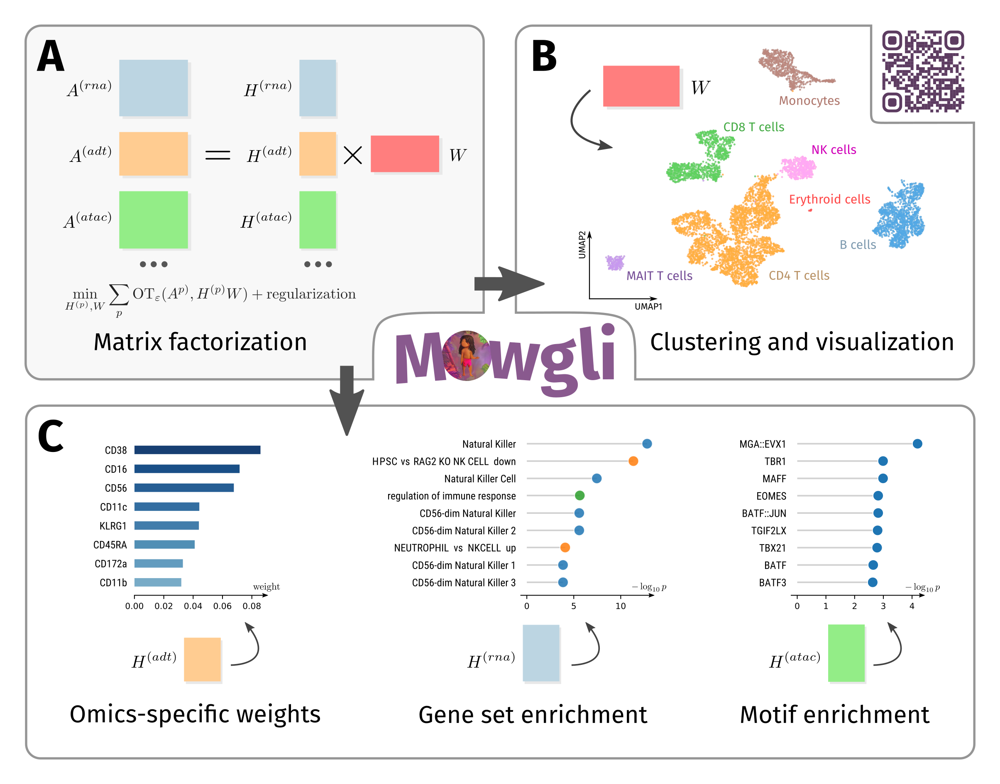

# Mowgli: Multi Omics Wasserstein inteGrative anaLysIs

Mowgli is a novel method for the integration of paired multi-omics data with any type and number of omics, combining integrative Nonnegative Matrix Factorization and Optimal Transport. [Read the preprint!]([soon](https://www.biorxiv.org/content/10.1101/2023.02.02.526825v2))

This is the code used to perform the experiments and generate the figures in our manuscript. If you are looking for the Python package, [click here!](https://github.com/cantinilab/Mowgli)



## Code structure


- `enrich` contains the code for the enrichment analysis
- `evaluate` contains the code for computing the various evaluation metrics
- `integrate` contains the code used to perform the integration with Mowgli, MOFA+, Seurat, Cobolt, Multigrate and integrative NMF
- `preprocess` contains the preprocessing code
- `visualize` contains the visualization code used to produce the figures of the paper

## Our preprint

https://www.biorxiv.org/content/10.1101/2023.02.02.526825v1

```bibtex
@article{huizing2023paired,
  title={Paired single-cell multi-omics data integration with Mowgli},
  author={Huizing, Geert-Jan and Deutschmann, Ina Maria and Peyr{\'e}, Gabriel and Cantini, Laura},
  journal={Nature Communications},
  volume={14},
  number={1},
  pages={7711},
  year={2023},
  publisher={Nature Publishing Group UK London}
}
```
